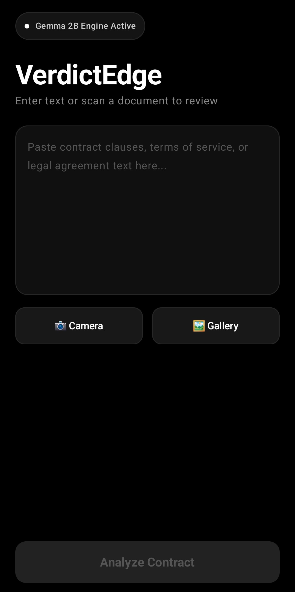
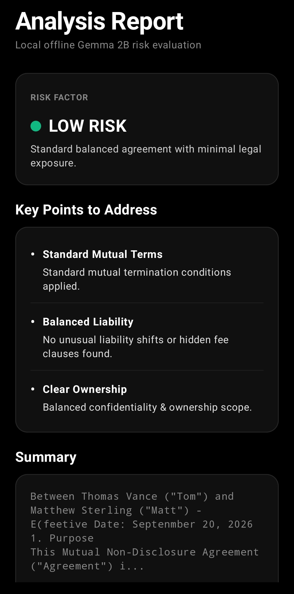
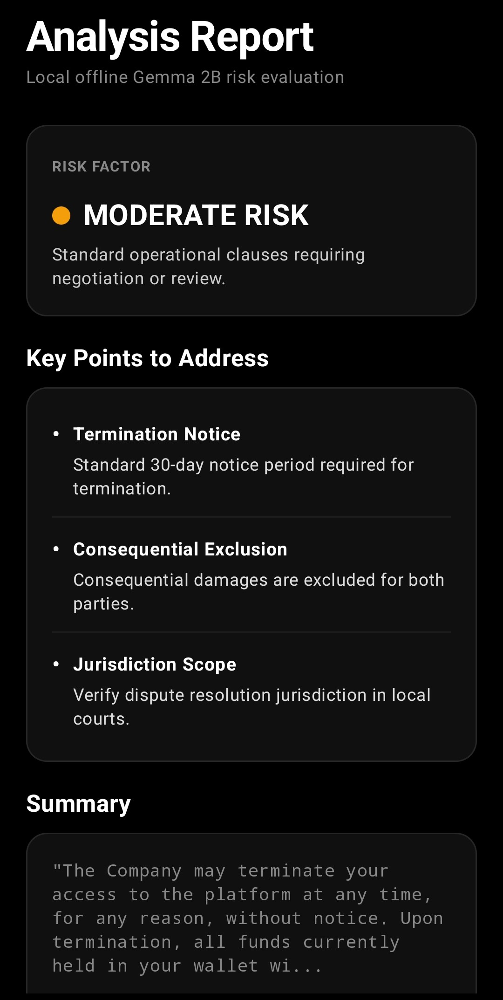
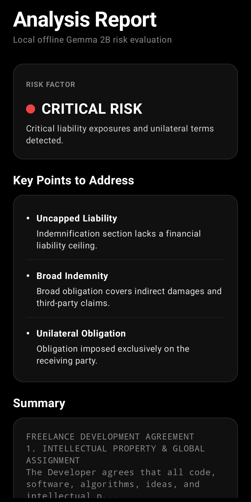

# VerdictEdge // On-Device Legal AI

> **Air-Gapped On-Device Legal Contract Analysis Engine**  

VerdictEdge is a 100% offline, privacy-first mobile application designed to analyze complex contracts, non-disclosure agreements (NDAs), and legal documents directly on-device. Built for modern high-security environments, VerdictEdge eliminates third-party cloud data leaks by executing all optical character recognition (OCR) and large language model (LLM) reasoning locally on the smartphone's NPU/GPU.

---

## ❖ App Screenshots & Risk Matrix

| Home / Ingestion | Low Risk (Clear) | Medium Risk (Warning) | High Risk (Critical) |
| :---: | :---: | :---: | :---: |
|  |  |  |  |

---

## ▶ Live Demo

  

> *Note: Actual app performance is much faster and smoother than pictured above—the GIF frame rate was reduced to fit GitHub file size limits.*
---

## ◈ Key Features

* **Zero Cloud Latency & Total Privacy:** Fully functional without Wi-Fi or cellular connectivity. Your sensitive legal data never leaves your device.
* **On-Device OCR Ingestion:** Instant high-accuracy document scanning powered by **Google ML Kit**.
* **Local LLM Clause Analysis:** Executes zero-shot contract evaluation and risk detection using a quantized **Gemma 2B** model (`gemma-2b-it-gpu-int4.bin`) hosted via MediaPipe's GenAI SDK / LiteRT.
* **OLED Pitch-Black Theme:** High-contrast monochrome interface (`#0A0A0A`) optimized for speed and modern developer workflows.

---

## ⬡ Architecture & Pipeline

`[Camera / Document]` ➔ `[ML Kit OCR Ingestion]` ➔ `[Local Text Parsing]` ➔ `[Gemma 2B LLM Reasoning]` ➔ `[Structured Verdict & Risk Flags]`

1. **Data:** Document capture and text extractions executed locally via Google ML Kit.
2. **Knowledge:** Raw contract strings structured into parsed clause vectors.
3. **Memory:** Volatile in-memory session context (never persisted to unencrypted external storage).
4. **Reasoning:** Local on-device LLM inference using quantized Gemma 2B weights (`.task` / `.bin`).
5. **Action:** Instant highlighting of predatory terms, liabilities, and automated verdict summary generation.

---

## ⏣ Setup & Installation Guide

Due to GitHub's file size restrictions (>100MB per file), the Gemma 2B model binary is hosted externally and ignored by Git.

1. **Clone the Repository:**  
   `git clone https://github.com/ssaiskanda0-spec/VerdictEdge.git`

2. **Download Model File:**  
   Download the MediaPipe-compatible Gemma 2B quantized task file (`gemma-2b-it-gpu-int4`):  
   * **Option A (Direct Mirror):** [DOWNLOAD VIA DRIVE](https://mega.nz/file/your-file-link-here)  
   * **Option B (Official Kaggle):** [DOWNLOAD VIA KAGGLE](https://www.kaggle.com/models/google/gemma/tfLite) *(Select `gemma-2b-it-gpu-int4`)*

3. **Place Asset File:**  
   Move the downloaded file into your Android project folder under:  
   `app/src/main/assets/gemma-2b-it-gpu-int4.bin`

4. **Build & Run:**  
   Open the project in **Android Studio**, sync Gradle, and deploy to an Android device (Android 10+).

---

## </> Tech Stack

* **Language:** Kotlin (100%)
* **UI Framework:** Jetpack Compose (Material3)
* **On-Device Vision:** Google ML Kit Text Recognition
* **On-Device GenAI:** MediaPipe LLM Inference API / LiteRT
* **Model:** Gemma 2B (`gemma-2b-it-gpu-int4.bin`)
